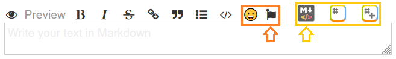

    

    
    
    
    

    
    
    

    

---

<h4 name="user-content-readme-top">(work in progress ...)</h4>
<h1 name="user-content-readme-top">Wysiwyg MD Editor plugin for Kanboard</h1>

Integrates external MD editors into Kanboard in order to conveniently edit/preview
(and eventually render) the markdown textareas in the Kanboard interface.
Each editor may allow for different customizations of functionality, MD features, and UI themes.

[<a href="#user-content-readme-bottom">&#8595; Bottom</a>] [<a href="#screenshots">&#8594; Next</a>] [<a href="#user-content-readme-top">&#8593; Top</a>]

## Features

- Currently integrates the [EasyMDE](https://github.com/Ionaru/easy-markdown-editor) and [StackEdit+](https://github.com/mafgwo/stackedit-plus) markdown editors
- Both editors are configured to be [GFM](https://github.github.com/gfm/) compatible
- Side preview is available, themes and various convenience options
- Configurable buttons to inject into the KB editing toolbar of markdown textareas

For a better preview and feel of the actual editors visit:
- `EasyMDE` [Live Demo](https://stackblitz.com/edit/easymde/?file=index.html)
- `StackEdit+` [Online App](https://stackedit.net/app#) 

[<a href="#user-content-readme-bottom">&#8595; Bottom</a>] [<a href="#features">&#8592; Previous</a>] [<a href="#usage">&#8594; Next</a>] [<a href="#user-content-readme-top">&#8593; Top</a>]

## Screenshots

**Configurable buttons of MD editors injected into the textarea editing toolbar.**  

**EasyMDE with side preview using the dimmed theme.**  

**StackEdit+ with side preview using the default dark theme.**  

[<a href="#user-content-readme-bottom">&#8595; Bottom</a>] [<a href="#features">&#8592; Previous</a>] [<a href="#installation--compatibility">&#8594; Next</a>] [<a href="#user-content-readme-top">&#8593; Top</a>]

## Usage

Go to `Settings` &#10562; `Wysiwyg MD Editor`

Follow the explanations to configure and preview the MD editor(s) of your preference.

[<a href="#user-content-readme-bottom">&#8595; Bottom</a>] [<a href="#screenshots">&#8592; Previous</a>] [<a href="#authors--contributors">&#8594; Next</a>] [<a href="#user-content-readme-top">&#8593; Top</a>]

## Installation & Compatibility

    
<strong>Installation</strong>

- Install via the **Kanboard Plugin Directory** or see [INSTALL.md](INSTALL.md)
- Read the full [**Changelog**](changelog.md "See changes") to see the latest updates

    
<strong>Compatibility</strong>

- Requires [Kanboard](https://github.com/kanboard/kanboard "Kanboard - Kanban Project Management Software") ≥`1.2.33`
- **Other Plugins & Action Plugins**
  - _No known issues_
- **Core Files & Templates**
  - `0` Template override
  - _No database changes_

    
<strong>Translations</strong>

- _`en_US` translation available ONLY_
- More translations might be mechanically added in the future using Google Translate

[<a href="#user-content-readme-bottom">&#8595; Bottom</a>] [<a href="#usage">&#8592; Previous</a>] [<a href="#license">&#8594; Next</a>] [<a href="#user-content-readme-top">&#8593; Top</a>]

## Authors & Contributors

- [Im[F(x)]](https://github.com/imfx77) - Author
- Contributors welcome _for translations_ !

[<a href="#user-content-readme-bottom">&#8595; Bottom</a>] [<a href="#installation--compatibility">&#8592; Previous</a>] [<a href="#user-content-readme-top">&#8593; Top</a>]

## Credits & References

- [EasyMDE](https://github.com/Ionaru/easy-markdown-editor)
- [Highlight.js](https://github.com/highlightjs/highlight.js)
- [StackEdit+](https://github.com/mafgwo/stackedit-plus)
- [stackedit.js](https://github.com/benweet/stackedit.js)

[<a href="#user-content-readme-bottom">&#8595; Bottom</a>] [<a href="#installation--compatibility">&#8592; Previous</a>] [<a href="#user-content-readme-top">&#8593; Top</a>]

## License

- This project is distributed under the [MIT License](LICENSE "Read The MIT license")

---

    
    
    
    
    
    
    

[<a href="#user-content-readme-top">&#8593; Top</a>]

